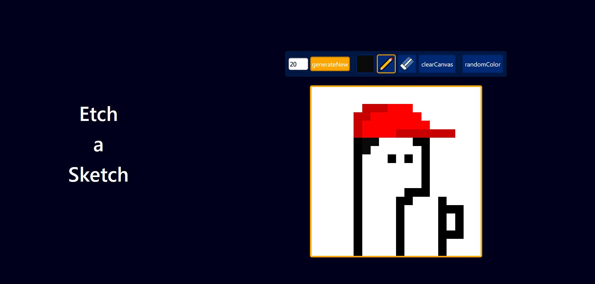
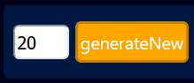
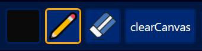
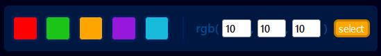

# Etch-a-Sketch
a web version of something between a sketchpad and an etch-a-sketch
## see the project live [here](https://introduction996.github.io/Etch-a-Sketch/)

### preview:

#### generate a new canvas size with this option on the toolbar:

#### interact with the canvas with these tools:

#### pressing the color picker opens up a separate menu, from which the color of the pen tool can be changed:
note: default colors as well as an rgb picker is available
